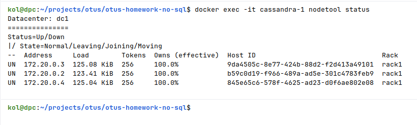
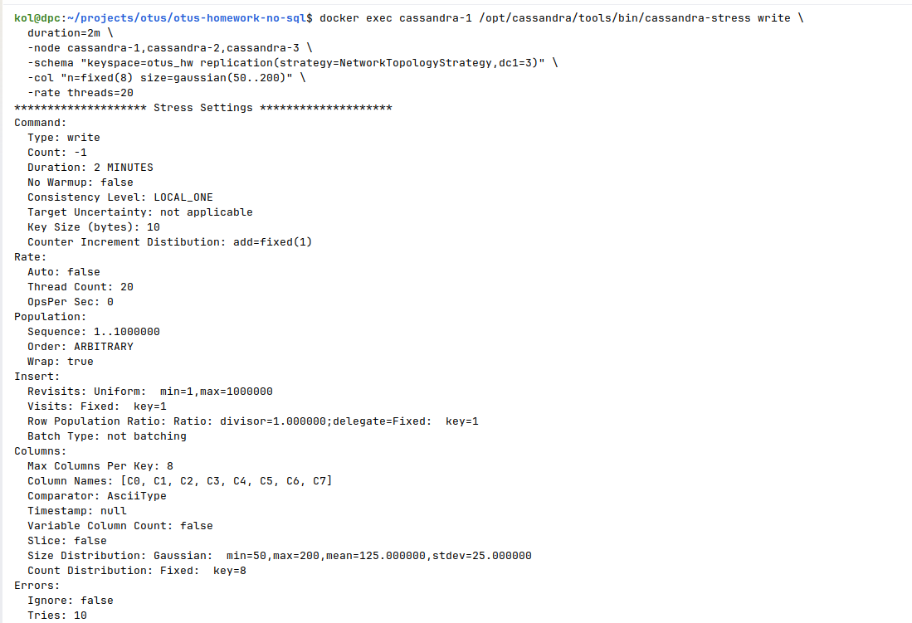
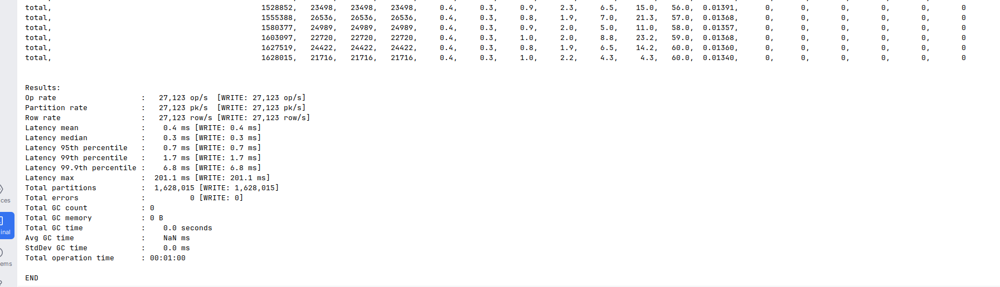
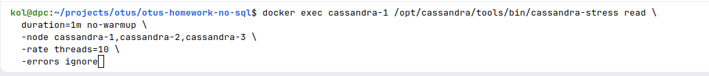
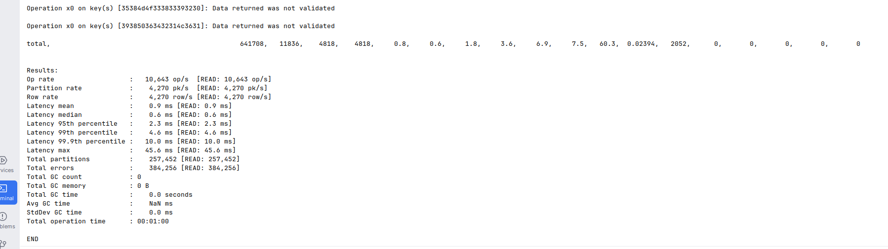
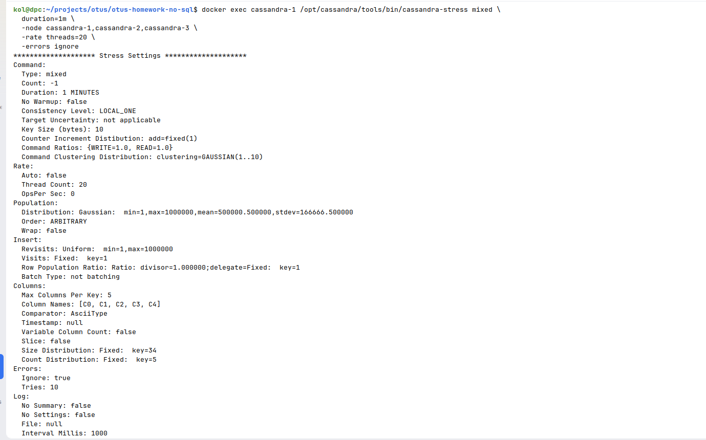
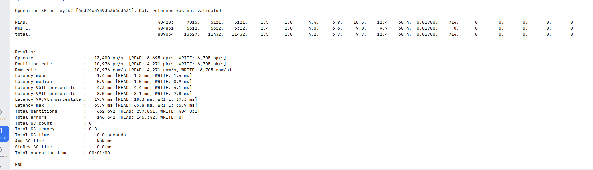

# Кластер Cassandra

#### 1) docker-compose.yaml [docker-compose.yaml](docker-compose.yaml)
#### 2) Создание схемы и таблиц [schema.cql](schema.cql)
#### 3) Инициализация таблиц данными [insert_data.cql](insert_data.cql)
#### 4) Примеры запросов к таблицам [queries.cql](queries.cql)

# Нагрузочное тестирование с помощью Apache Cassandra Stress Tool

```bash
docker exec cassandra-1 nodetool status
``` 

### 1. Тест записи (Write)

```bash
docker exec cassandra-1 /opt/cassandra/tools/bin/cassandra-stress write \
  duration=1m \
  -node cassandra-1,cassandra-2,cassandra-3 \
  -rate threads=10
```

### 2. Тест чтения (Read)

```bash
docker exec cassandra-1 /opt/cassandra/tools/bin/cassandra-stress read \
  duration=1m no-warmup \
  -node cassandra-1,cassandra-2,cassandra-3 \
  -rate threads=10 \
  -errors ignore
```

### 3. Смешанная нагрузка (Mixed)

```bash
docker exec cassandra-1 /opt/cassandra/tools/bin/cassandra-stress mixed \
  duration=2m \
  -node cassandra-1,cassandra-2,cassandra-3 \
  -rate threads=20 \
  -errors ignore
```

### Результаты тестирования

#### 

#### write test



#### read test



####  mixed test



# Учебный проект

 На предыдущем курсе в OTUS по Kotlin разработке я делал проектную работу 
 с использованием Cassandra, если интересно то можете ознакомиться здесь  
 
https://github.com/jep21s/core-messenger-project/tree/master/core-service/core-service-repo-cassandra/src/main/kotlin/org/jep21s/messenger/core/service/repo/cassandra  

Описание подходов которые я использовал:

### 1. Query-Driven моделирование данных

Таблицы спроектированы исходя из паттернов доступа. Главная таблица сообщений использует `chat_id` как partition key — все сообщения одного чата хранятся на одном узле. Clustering columns `sent_date DESC, id ASC` обеспечивают автоматическую сортировку «новые первыми» с детерминированным порядком при одинаковых таймстемпах. Таблица чатов использует составной partition key из `id` и `communication_type`.

### 2. Денормализация для альтернативных путей доступа

Базовая таблица чатов не позволяет эффективно искать «все чаты по последней активности». Для этого создана отдельная денормализованная таблица `chat_activity`. Репозиторий пишет в обе таблицы одновременно, а поиск сначала читает из `chat_activity`, затем обогащает данными из `chats`.

### 3. Time-Bucketed партиционирование

В таблице активности чатов partition key содержит день в текстовом виде (например, `"2025-11-24"`). Это ограничивает размер партиций, позволяет сканировать только нужные дни при поиске и предотвращает образование горячих партиций.

### 4. Materialized View для доступа по типу сообщения

Таблица сообщений не поддерживает фильтрацию по типу. Materialized view добавляет `message_type` в partition key, позволяя эффективно запрашивать сообщения конкретного типа в чате. Cassandra автоматически поддерживает данные в актуальном состоянии.

### 5. SASI-индекс для полнотекстового поиска

Для поиска по содержимому сообщений используется кастомный SASI-индекс в режиме CONTAINS с NLP-обработкой: стемминг, нормализация регистра, удаление стоп-слов. Это позволяет выполнять поиск по подстроке без полного сканирования партиции.

### 6. Lightweight Transactions (LWT)

Все INSERT-операции используют условную вставку (ifNotExists). Это обеспечивает идемпотентность — при повторной вставке возвращается уже существующая запись без создания дубликата. LWT использует Paxos-протокол Cassandra.

### 7. Разделение уровней консистентности

Запись и удаление используют `QUORUM` для надёжности (требуется для LWT). Чтение и поиск — `LOCAL_QUORUM` для скорости при сохранении консистентности внутри дата-центра. Миграции схемы выполняются с уровнем `ALL`.

### 8. Динамическое построение запросов

Вместо статических CQL-строк запросы собираются динамически через QueryBuilder. Каждый предикат добавляется только если передан соответствующий фильтр. При активации полнотекстового поиска сортировка отключается, так как Cassandra не может совмещать SASI-поиск с ORDER BY.

### 9. Асинхронная пагинация

Реализован рекурсивный обход страниц Cassandra — результаты автоматически подгружаются через fetchNextPage(), накапливаются и возвращаются как единый список только после загрузки всех страниц.

### 10. Многошаговый поиск с дедупликацией

Поиск чатов реализован как оркестрация нескольких запросов: данные читаются из таблицы активности за N дней, дедуплицируются по идентификатору чата с сохранением последней активности, затем каждый чат обогащается полными данными из основной таблицы, фильтруется и сортируется на уровне приложения.
