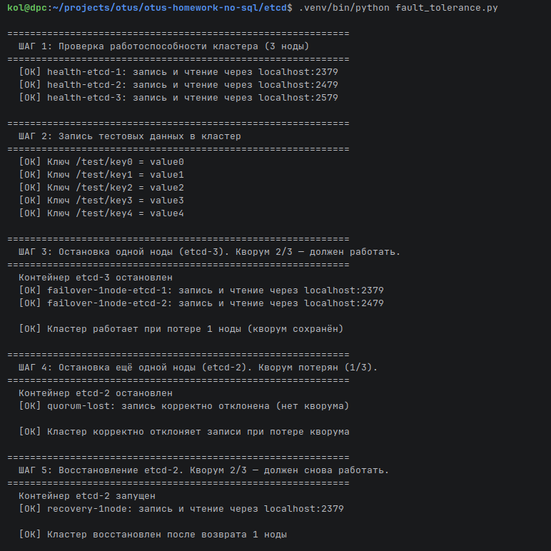
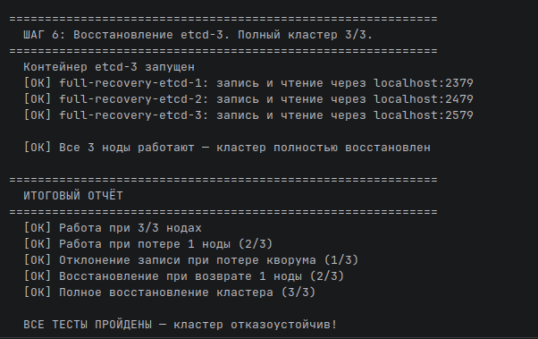

# Проверка отказоустойчивости Etcd кластера

### 1. Запустить [docker-compose.yaml](docker-compose.yaml)
### 2. Запустить python скрипт [fault_tolerance.py](fault_tolerance.py)

Скрипт проверяет отказоустойчивость в следующих кейсах
1. Проверяет работу всех 3 нод
2. Останавливает 1 ноду (кластер работает (кворум 2/3))
3. Останавливает ещё 1 ноду - записи отклоняются (кворум потерян)
4. Восстанавливает ноды - кластер снова полностью работоспособен

## Результаты выполнения тестирования отказоустойчивости кластера Etcd

