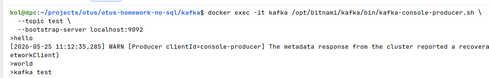
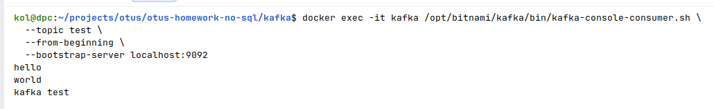
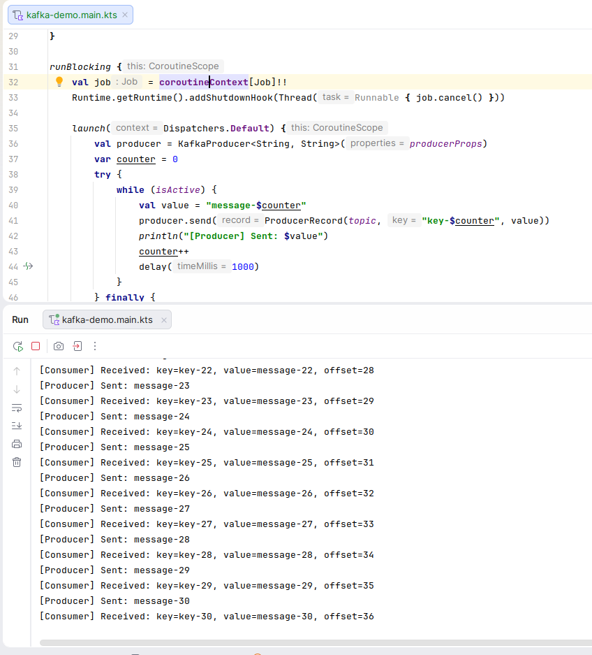

### 1. Запустить [docker-compose.yml](docker-compose.yaml)
### 2. Отправка сообщений через kafka-produce

### 3. Чтение сообщений через kafka-consumer

### 4. Програмное чтение/запись сообщений с помощью официальной библиотеки org.apache.kafka:kafka-clients в kotlin-script
#### Скрипт: [kafka-demo.main.kts](kafka-demo.main.kts)

