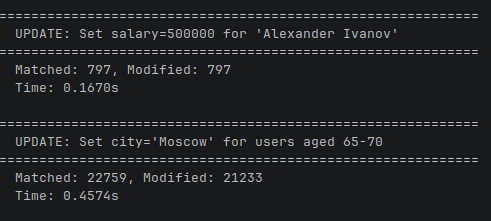
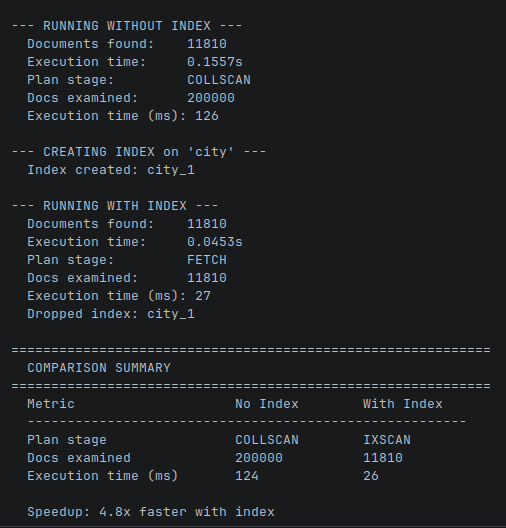

1) Скрипт fill_data.py заполняет данными mongo
2) Скрипт queries.py демонстрирует базовые запросы
3) Скрипт index_demo.py запускает демонстрацию преимуществ использования индексов

## Результаты выполнения запросов

### Select 1

### Select 2

### Select 3

### Update

## Результаты выполнения запросов с индексами и без

