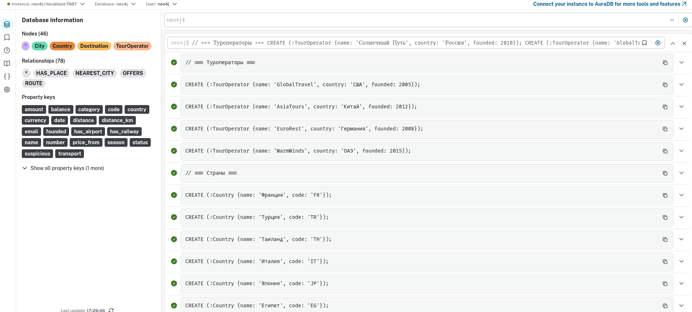
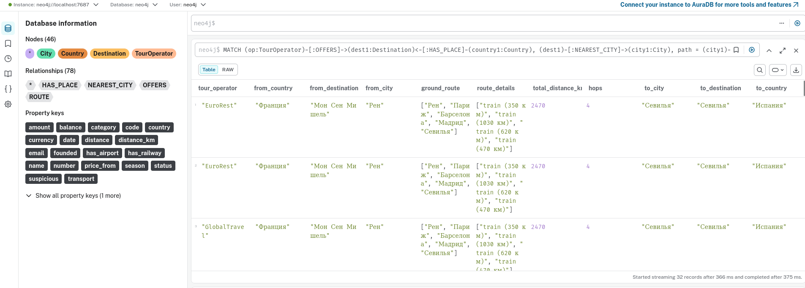
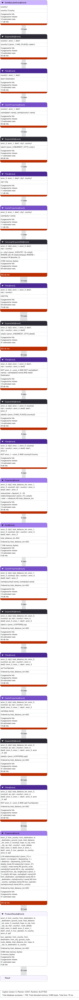
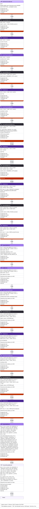

# Инициализация Neo4j данными

# Результаты выполнения запроса

## Расширенный результат [match_result.json](match_result.json)

# Запросы [cypher/](cypher/)

# Profile до построения индексов

# Profile после построения индексов

### Разница скорости выполнения запроса х10 раз
