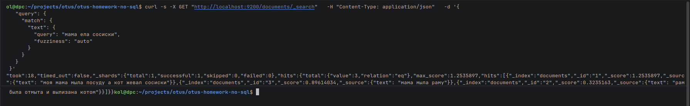

# Инициализация Opensearch

1) Запустить [docker-compose.yaml](docker-compose.yaml)
2) После успешного старта контейнера запусть скрипт [init.sh](init.sh) 
для инициализации индекса с необходимыми настройками для поиска по русским словам
3) Выполнить curl запрос к контейнеру  
```bash
curl -s -X GET "http://localhost:9200/documents/_search" \
  -H "Content-Type: application/json" \
  -d '{
    "query": {
      "match": {
        "text": {
          "query": "мама ела сосиски",
          "fuzziness": "auto"
        }
      }
    }
  }'
```

## Результат выполненного запроса 



```json
{
  "took": 18,
  "timed_out": false,
  "_shards": {
    "total": 1,
    "successful": 1,
    "skipped": 0,
    "failed": 0
  },
  "hits": {
    "total": {
      "value": 3,
      "relation": "eq"
    },
    "max_score": 1.2535897,
    "hits": [
      {
        "_index": "documents",
        "_id": "1",
        "_score": 1.2535897,
        "_source": {
          "text": "моя мама мыла посуду а кот жевал сосиски"
        }
      },
      {
        "_index": "documents",
        "_id": "3",
        "_score": 0.89614034,
        "_source": {
          "text": "мама мыла раму"
        }
      },
      {
        "_index": "documents",
        "_id": "2",
        "_score": 0.3235163,
        "_source": {
          "text": "рама была отмыта и вылизана котом"
        }
      }
    ]
  }
}
```