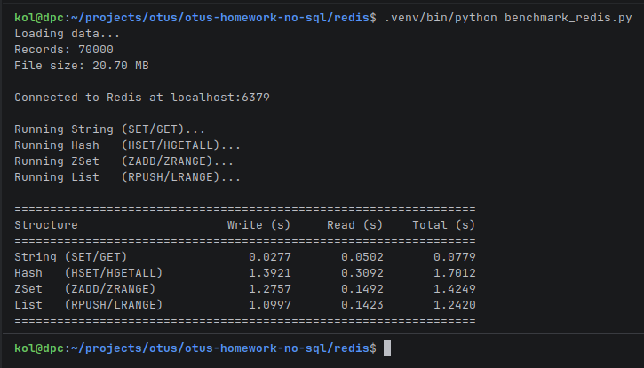

### 1) Запустить [docker-compose.yaml](docker-compose.yaml)
### 2) Сгенерировать json файл с помощью python скрипта [generate_json.py](generate_json.py)
### 3) После успешного запуска redis и создания json файла запустить скрипт [benchmark_redis.py](benchmark_redis.py) для тестирования скорости чтения и записи json файла в redis

### Результаты тестирования:

